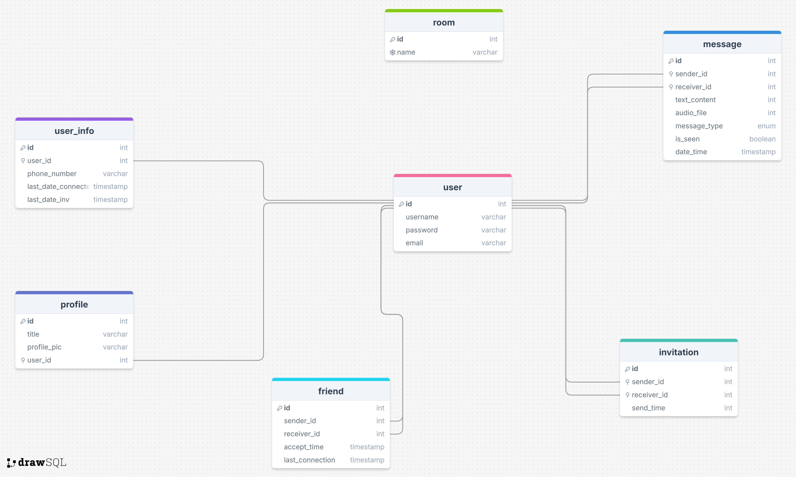

# Chat App

Welcome to the **Chat App** repository! This project is a fully featured chat application offering capabilities such as realtime **text messaging**, **voice and picture sharing**, **video calls**,**send invitations** and more. If you're looking to build a comprehensive chat app with these features, you're in the right place!

Before diving into the code, I highly recommend reviewing this README to understand the app’s architecture. It will help you get familiar with the structure and make it easier to add your own custom features.


## Cloning and Launching the App

### 1. **Cloning the Repository**

To get started, clone this repository on your local machine:

**Flutter App**
```bash
git clone https://github.com/diaazg/chatMobileApp
```

**Django App**
```bash
git clone https://github.com/diaazg/CBV
```

### 2. **Launching the Flutter App**
- Navigate to the Flutter app folder

```bash
cd chatMobileApp
```

- Install the necessary dependencies

```bash
flutter pub get
```
- Connect a device or start an emulator

- Run the app

```bash
flutter run
```
<br>

---

### 3. **Launching the Django App**
- Navigate to the Django app folder

```bash
cd CBV
```

- Create a virtual environment (optional but recommended)

```bash
python -m venv venv
source venv/bin/activate  # For Windows: venv\Scripts\activate
```
- Install the required dependencies

```bash
pip install -r requirements.txt
```
- Set up the PostgreSQL database
  - Make sure PostgreSQL is installed and running.
  - Create a new PostgreSQL database and configure the connection in your `settings.py`
  - Run migrations to set up the database schema:

  ```bash 
  python manage.py migrate
  ```

- Create a superuser for admin access
  ```bash 
  python manage.py createsuperuser
  ```

- Launch the Django development server

  ```bash 
  python manage.py runserver 0.0.0.0:8000
  ```


## Project Features

- **Send Text Messages**

- **Send Media Messages** (Voices, Images)

- **Video Calls**

- **Invitations and Friendships**

- **Authentication System**

- **Track User Status** (Active, Inactive)

## Technologies Used

- **Flutter**: For the mobile application
- **Django**: For the server-side logic
- **PostgreSQL**: For the database
- **Zego Cloud**: For video calls

---

## App Structure

The project follows **clean architecture** principles, providing a well-organized codebase. Here’s a breakdown of the structure:

### 1. **App**
   - This is the root of your Flutter project, where the application is initialized.

### 2. **Main**
   - The entry point of the application (`main.dart`). This file is responsible for bootstrapping the app, including setting up themes, routes, and initial widgets.

### 3. **Core**
   The `core` folder is divided into three layers, following the **clean architecture** pattern:
   - **Data**: Handles the data layer, including API calls, repositories, and data models.
   - **Domain**: Contains the business logic of the app, such as entities and use cases. This layer abstracts the data layer from the UI.
   - **Presentation**: This is the UI layer, containing Flutter widgets, screens, and state management logic (e.g., BLoC, Cubit, or Provider).

### 4. **Utils**
   The `utils` folder contains various helper classes and services that are used throughout the app:
   - **API Folder**: Manages external API interactions, including classes for handling HTTP requests and responses.
   - **Classes Folder**: Contains utility classes such as:
     - **Record Voice**: For managing voice recording features.
     - **Camera**: For managing camera functionalities (e.g., capturing photos or videos).
     - **Singleton Utilities**: Ensures classes like the camera and voice recording are singletons, improving resource management.
   - **Error Folder**: Contains error-handling mechanisms, such as logging errors and managing exceptions across the app.
   - **Socket Folder**: Contains WebSocket-related classes for handling real-time data communication (e.g., for chat or notifications).

---

## Django App Architecture

- **`consumers.py`**: Handles WebSocket requests and manages the WebSocket communication process.
- **`middleware.py`**: Contains middleware functions, such as checking JWT authentication.
- **`views.py`**: Manages HTTP requests.
- **`services.py`**: Contains reusable functions used by both `views` and `consumers`.

---

## Database Design




The project uses a SQL database (PostgreSQL) because most tables are interrelated. The schema demonstrates how these tables are connected. If any field is unclear, don't worry—everything is explained in this document.

### User Info:
- **last_date_connected**: Tracks user connectivity, updating each time the user interacts with the server.
- **last_date_inv**: Used to track new invitations that the user hasn’t seen yet.

### Friend:
- **last_connection**: Helps in ordering friend messages in the chat screen. This field is updated whenever a message is sent between two users.

---

## App Workflow

When a user logs in, they can search for people and send invitations. Users cannot communicate with each other until they become friends.  
Once an invitation is accepted, a chat room appears for both users, allowing them to start communicating.

### Chat System Workflow

When a user enters a chat room, a WebSocket request is sent to the server. Here’s how the process works:

1. Upon entering the chat, the user connects to a WebSocket URL: `ws://$pcAdr:8000/ws/chat/$roomName/`, where `$roomName` identifies the chat room.
2. **Room Name**: The room name is defined as `userID_senderID` and is stored in the database when the invitation is first accepted.
3. Upon connection, the WebSocket checks if the room exists by evaluating:
   - `room_id == senderID_receiverID || room_id == receiverID_senderID`
4. This is handled by the `room_exists` function, which ensures the correct room is used for communication:

```python
@sync_to_async
def room_exists(self, room_name):
    if Room.objects.filter(name=room_name).exists():
        return {'exist': True, 'value': room_name}
    else:
        user_ids = self.room_name.split('_')
        if len(user_ids == 2):
            user1_id, user2_id = user_ids
            new_name = f'{user2_id}_{user1_id}'
            exist = Room.objects.filter(name=new_name).exists()
            return {'exist': exist, 'value': new_name}
        else:
            return {'exist': False, 'value': ''} 
            
```
### Video Call Feature
The video call functionality uses Zego Cloud. It requires a `roomID` to identify the video call room, and this `roomID` is provided by the WebSocket server during the chat session:

```python
room_name = event['room_name']

await self.send(text_data=json.dumps({
    'action': 'start_video_call',
    'room_name': room_name
}))         
```


## Conclusion

The **Chat App** provides a full-fledged, real-time messaging experience with support for media, video calls, and friend management. By leveraging **Flutter** for the front-end and **Django** for the back-end, this project demonstrates how to build a scalable chat application with a well-organized architecture, following clean coding principles. Whether you're looking to extend the app with new features or learn from its structure, this project serves as a robust foundation for building modern, interactive messaging platforms.

Feel free to explore, contribute, or customize the app to suit your needs. If you have any questions, don’t hesitate to reach out!
